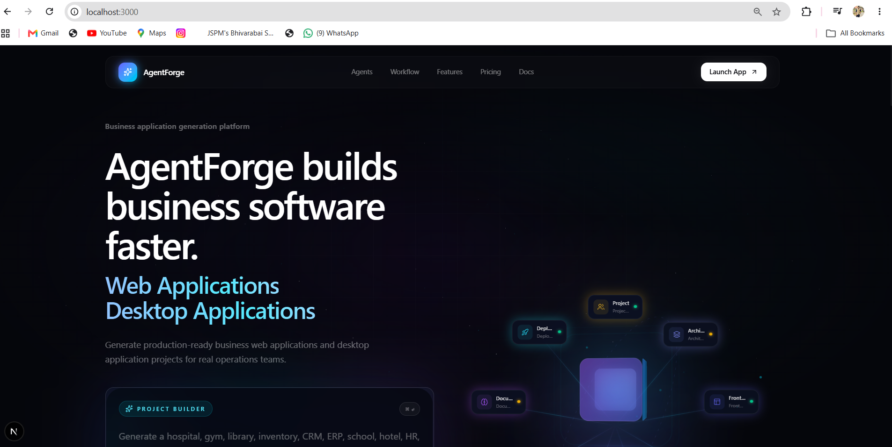
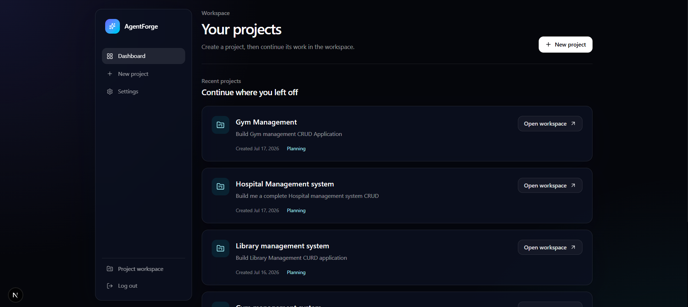
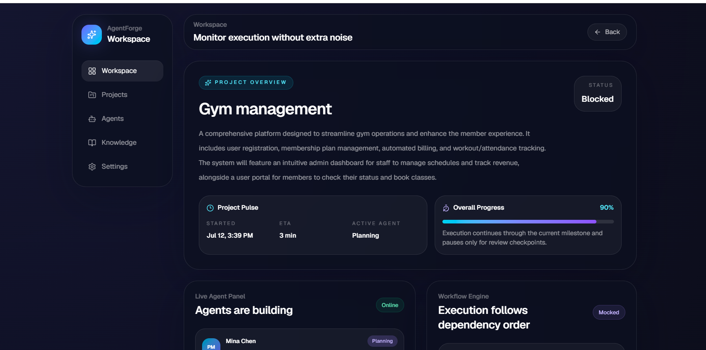
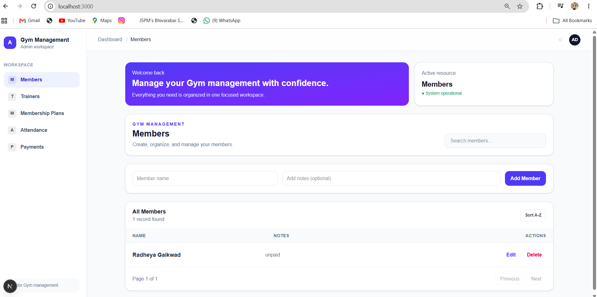
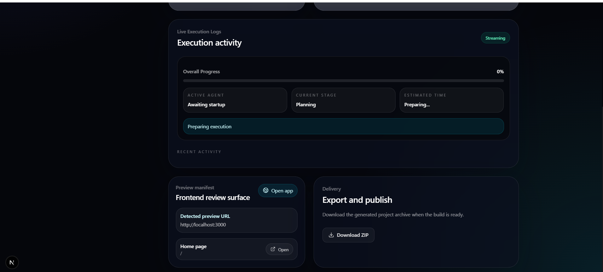

# 🤖 AgentForge AI

### An AI-Powered Multi-Agent Platform for Automated Software Development

Generate production-ready **Web Applications** and **Desktop Applications** using autonomous AI software engineering agents that collaborate to design, develop, validate, and package complete applications from a single prompt.


---


# 📖 Project Overview

AgentForge AI is a **Multi-Agent AI Software Engineering Platform** designed to automate the software development lifecycle. Instead of relying on a single AI model to generate code, the platform coordinates multiple specialized AI agents that work together like a professional software engineering team.

From a single project prompt, AgentForge AI analyzes business requirements, designs the system architecture, generates frontend and backend code, creates the database schema, validates the generated project, and packages the final application into a downloadable ZIP file.

The platform focuses on generating **business-oriented Web Applications and Desktop Applications** with production-ready project structures, responsive user interfaces, REST APIs, database integration, and complete CRUD functionality.

Unlike traditional AI coding assistants that generate isolated code snippets, AgentForge AI provides an end-to-end software generation workflow through autonomous AI collaboration.

---

## 🎯 Project Information

| Attribute | Details |
|------------|---------|
| **Project Name** | AgentForge AI |
| **Project Type** | AI-Powered Multi-Agent Software Engineering Platform |
| **Purpose** | Automate end-to-end software development using autonomous AI agents |
| **Supported Outputs** | Web Applications & Desktop Applications |
| **Architecture** | Multi-Agent Workflow |
| **AI Provider** | OpenRouter |
| **Framework** | Next.js |
| **Language** | TypeScript |
| **Database ORM** | Prisma |
| **Current Status** | MVP Completed |
| **Developer** | Radheya Gaikwad |

---


# ❓ Why AgentForge AI?

Software development is often a collaborative process involving multiple engineers, architects, testers, and deployment specialists. While modern AI coding assistants can generate code, they typically work as a single assistant and do not simulate the complete software engineering lifecycle.

AgentForge AI was built to bridge this gap by introducing a **Multi-Agent AI Software Engineering Platform** where specialized AI agents collaborate to perform different engineering tasks, resulting in a structured, production-oriented development workflow.

The platform automates the journey from a simple project idea to a fully generated application while maintaining a modular and extensible architecture.

---

## 🚀 Problems with Traditional Development

| Traditional Development | Challenges |
|--------------------------|------------|
| Manual Requirement Analysis | Time-consuming and inconsistent |
| Manual Software Architecture | Requires experienced architects |
| Separate Frontend & Backend Development | Increased development effort |
| Manual Database Design | Error-prone schema creation |
| Manual Testing & Validation | Slower release cycles |
| Manual Packaging & Delivery | Additional deployment effort |

---

## 💡 How AgentForge AI Solves These Problems

| AgentForge AI Capability | Benefit |
|---------------------------|---------|
| AI Product Manager | Understands business requirements from natural language prompts |
| AI Software Architect | Designs scalable project architecture automatically |
| AI Frontend Engineer | Generates responsive modern user interfaces |
| AI Backend Engineer | Builds APIs, business logic, and CRUD operations |
| AI Database Engineer | Creates optimized Prisma schemas and database models |
| AI QA Engineer | Validates generated source code and project structure |
| AI DevOps Engineer | Packages the application into a production-ready downloadable ZIP |

---

## 🌟 Key Advantages

- 🤖 Multi-Agent AI Collaboration instead of a single AI assistant
- ⚡ End-to-End Software Generation from one project prompt
- 🖥️ Supports Business Web Applications and Desktop Applications
- 📦 Production-ready project packaging with ZIP export
- 🏗️ Modular architecture for future scalability
- 🔄 Real-time workflow tracking across AI agents
- 🎯 Generates complete CRUD-based business applications

---


# ✨ Key Features

AgentForge AI combines autonomous AI agents with a structured software engineering workflow to generate complete business applications from a single prompt.

---

## 🚀 Platform Features

| Feature | Description |
|----------|-------------|
| 🤖 Multi-Agent Architecture | Uses multiple specialized AI agents instead of relying on a single LLM. |
| 📝 AI Requirement Analysis | Converts natural language prompts into structured software requirements. |
| 🏗 AI Software Architecture | Automatically designs scalable project architecture and folder structure. |
| 🎨 Frontend Generation | Generates responsive and modern user interfaces using Next.js and Tailwind CSS. |
| ⚙ Backend Generation | Creates REST APIs, business logic, validation, and CRUD operations. |
| 🗄 Database Generation | Automatically generates Prisma schema and database models. |
| 🧪 AI Validation | Reviews generated source code before packaging the project. |
| 📦 ZIP Export | Packages the generated application into a downloadable ZIP archive. |
| 📊 Live Progress Tracking | Displays real-time execution progress for every AI agent. |
| 📁 Project Workspace | Centralized dashboard for monitoring generation, logs, validation, and downloads. |
| 🔄 Modular Workflow | Easily extendable architecture allowing additional AI agents in future versions. |
| 🖥 Business Application Generation | Generates business-focused Web Applications and Desktop Applications. |

---

## 📌 What AgentForge AI Generates

| Category | Examples |
|----------|----------|
| 🏢 Business Management | Gym Management, Inventory Management, Library Management, Hospital Management |
| 📊 Enterprise Systems | CRM, ERP, HRMS, Employee Management |
| 🏪 Retail Systems | Billing Systems, POS, Store Management |
| 🎓 Educational Systems | School Management, College ERP, Student Portal |
| 🏥 Healthcare Systems | Clinic Management, Appointment Scheduling |
| 💼 Office Applications | Task Manager, Attendance System, Leave Management |

---

## 💎 Platform Highlights

- Autonomous Multi-Agent Software Engineering Workflow
- End-to-End Project Generation
- AI-Powered Requirement Analysis
- Automated Architecture Design
- Production-Ready Project Structure
- REST API Generation
- Complete CRUD Operations
- Prisma ORM Integration
- Responsive Modern UI
- Real-Time Progress Monitoring
- Downloadable ZIP Package
- Scalable and Modular Architecture

---

## 🛠 Technology Stack

| Category | Technologies |
|----------|--------------|
| **Frontend** | Next.js, React, Tailwind CSS |
| **Backend** | Next.js API Routes |
| **Language** | TypeScript |
| **AI** | OpenRouter API |
| **Database** | Prisma ORM, SQLite *(PostgreSQL Ready)* |
| **State Management** | Zustand |
| **Validation** | Zod |
| **Package Manager** | npm |
| **Version Control** | Git & GitHub |

---


**📷 Image:** Later replace this diagram with an architecture image.

---

# STEP 7 — 🤖 AI Agents

```md
## 🤖 AI Agents

| Agent | Responsibility |
|--------|---------------|
| Product Manager | Requirement Analysis |
| Software Architect | System Design |
| Backend Engineer | APIs & Business Logic |
| Frontend Engineer | UI Generation |
| Database Engineer | Prisma Schema |
| QA Engineer | Validation |
| DevOps Engineer | Packaging & ZIP Export |

---


## 📸 Screenshots

### 🏠 Landing Page


### 📝 Create New Project


### 🤖 AI Workspace


### 💻 Generated Application


### 📦 ZIP Export


## 👨‍💻 Author

**Radheya Gaikwad**

🎓 B.E. Artificial Intelligence & Data Science

📧 Email: **radheagikwad76@gmail.com**

🔗 GitHub: **https://github.com/RadheyaGaikwad**

💼 LinkedIn: **https://www.linkedin.com/in/radhegaikwad/**

---

### ⭐ Support the Project

If you found **AgentForge AI** useful or interesting, please consider giving this repository a ⭐ on GitHub. Your support helps improve the project and motivates future development.

---